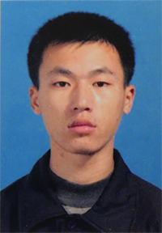

# Xiaoli Wang (王晓莉)

Ph.D. Candidate\
Central South University, Xiangya School of Pharmacy\
Changsha, Hunan, China\
Email: xiaoli.wang [AT] csu.edu.cn

## Research interests
- AI-Driven Drug Design (AIDD)
- Natural language processing (NLP)
- Information Systems

## Education  
- **Ph.D. Candidate in Pharmacy**, Central South University (Sep 2025 – Present)
- **M.Sc. in Electronic Information Technology**, Hunan Normal University (Sep 2022 – Jun 2025)\
  GPA: 3.95/4.0, Top 1%
- **B.Sc. in Software Engineering**, Hunan University (Sep 1999 – Jun 2003)

## Publications
- 2017: *[Programming Google App Engine with Python](https://www.amazon.com/Programming-Google-Engine-Python-Infrastructure-ebook/dp/B010GNIV88)* (Chinese Translation of Dan Sanderson’s book).

## Awards
- Nov 2024 - Second Prize, 5th Hunan Graduate AI Innovation Competition 
- Sep 2024 - Third Prize, 6th China Graduate AI Innovation Competition (National Finals)
- Nov 2023 - First Prize, 4th Hunan Province Graduate AI Innovation Competition

## Selected Research Projects
- **Target Ligand Database (TarLiDB)** (May 2025 – Oct 2025)\
Developing a ligand-centric molecular database integrating cheminformatics (RDKit, ADMETlab 3.0) with AI/ML methods to support virtual screening, ADMET profiling, and drug discovery workflows.

- **Thesis Evaluation Insight Mining Platform (TEIMP)** (Jun 2023 – Jun 2025)\
NLP and ML platform to analyze thesis review comments, extracting patterns to support academic evaluation.

- **ReviewBot** (Mar 2023 – Jun 2023)\
Automated system for generating responses to Apple App Store reviews using OpenAI GPT.

- **Contributions to HuggingFace/Transformers** (Jun 2023)\
Open-source contributions to a state-of-the-art NLP and machine learning framework supporting PyTorch, TensorFlow, and JAX.  

## Industrial & Entrepreneurial Projects
- **Intelligent Vehicle Weighing and Accounting System** – Project Manager & Developer (2022)\
Automated weighing and billing for garbage transportation vehicles (Hunan Vary Technology).
- **Bosch Logistics Control Tower, Changsha** – Developer (2021)\
Built data dashboards for logistics operations.
- **WEMOVE (IoT Tents, Hangzhou Lvjia Technology)** – CTO (Jan 2016 – Dec 2017)\
Led software/hardware integration for IoT-enabled tents; part of Hangzhou High-Tech “5050 Plan.”
- **BallQ (Football Live Score Platform)** – CTO (May 2014 – Dec 2015)\
Developed live score & prediction platform; raised RMB 16M in funding.
- **TickTick (Task Management App)** – CTO (Mar 2012 – May 2013)\
Designed and launched a task management app, later expanded into a global productivity tool.

## Technical Skills  
- **Programming:** Python, Java, C++, C
- **Databases:** MySQL, PostgreSQL (design, optimization, querying, data integrity)
- **Machine Learning / NLP:** Transformers, HuggingFace, OpenAI GPT APIs
- **Software Development:** 20+ years of experience in scalable systems and full-stack development

## Languages  
- **Mandarin:** Native  
- **English:** Fluent (CET-4, CET-6, strong oral communication)  
- **Cantonese:** Listening – Yes; Speaking – No  
